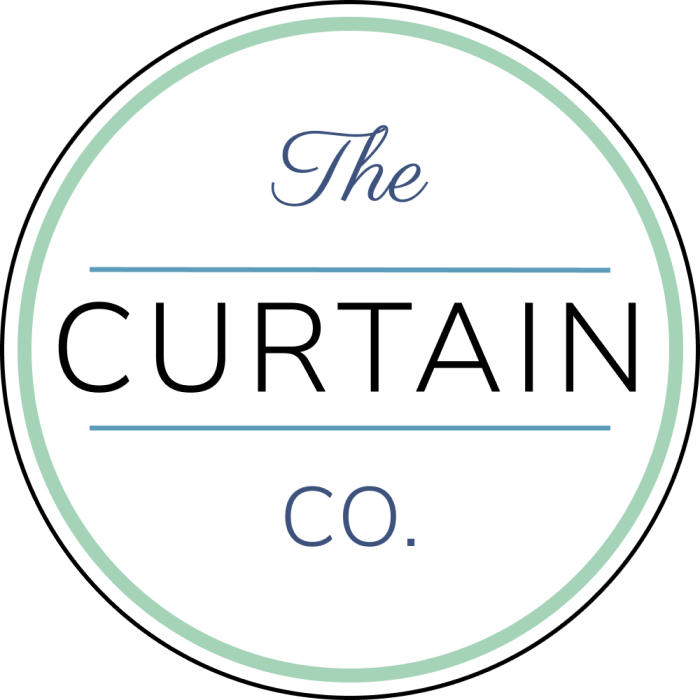
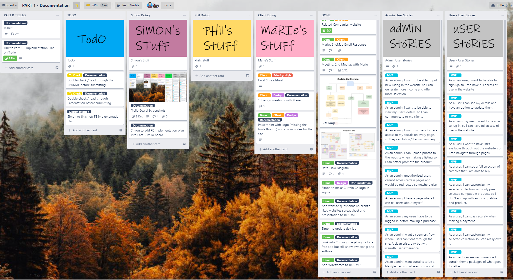
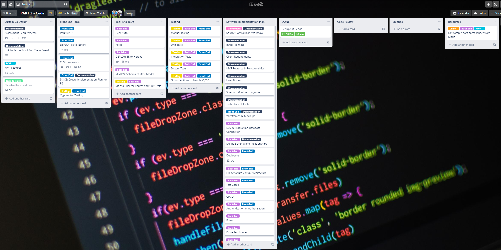
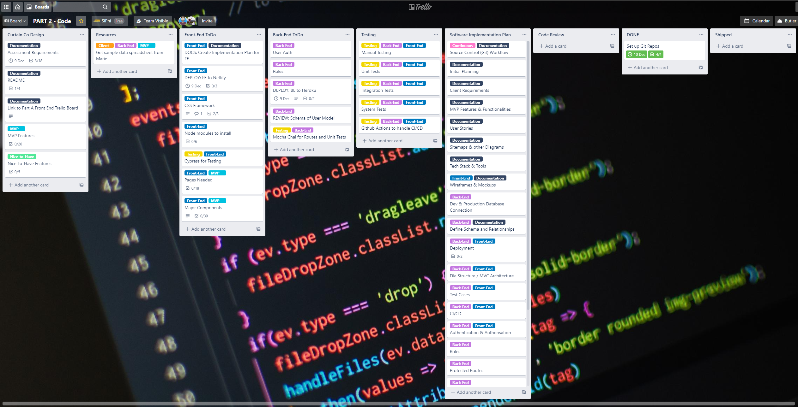
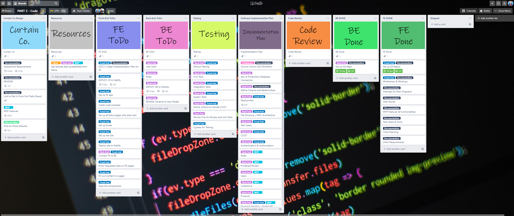

# The Curtain Co

 

 

  
Link to App: [thecurtainco.com.au](https://thecurtainco.com.au)  
Front-End source code: [FE Repo](https://github.com/SimoSultan/curtainco_fe)  
Back-End source code: [BE Repo](https://github.com/philrussel21/curtain_co_BE)

###### By Simon Curran ([GitHub: SimoSultan](https://github.com/SimoSultan)) and Phil Antiporda ([GitHub philrussel21](https://github.com/philrussel21))

---

## Index:

-   [**Purpose**](#Purpose) - why the app was built
-   [**Target Audience**](#Target-Audience) - what can the app do
-   [**Features and Functionalities**](#Features-and-Functionalities) - what can the app do
-   [**Tech Stack**](#Tech-Stack) - the languages that make up the app
-   [**Dependencies and Resources**](#Dependencies-and-Resources) - the node modules used throughout the app and their resources
-   [**Dataflow Diagram**](#Dataflow-Diagram) - how data flows through the app
-   [**Application Architecture Diagram**](#Application-Architecture-Diagram) - how the app is connected
-   [**User Stories**](#User-Stories) - how the app would behave according to different user roles
-   [**Testing**](#Testing) - how we intend to test the app
-   [**Sitemap**](#Sitemap) - how the user gets around the app
-   [**Wireframes**](#Wireframes) - the look and feel of the app
-   [**Development Timeline**](#Development-Timeline) - development log and Trello
-   [**Copyright**](#Copyright) - legal information
-   [**Authors**](#Authors) - who wrote this README doc

---

## Purpose

The purpose of the app is to migrate the client’s business, along with her ideas, into a dynamic website. This website embodies elegance and sophistication to bring a unique experience to its users.
It would be the client’s platform where she can share her suggestions and expertise in the industry while selling curtains and product samples. The website would also allow interested parties to communicate with the client through email thus expanding her own clientele.

---

## Target Audience

The target audience of this website are users that are willing to spend a little bit more in exchange for quality experience and designer-picked products that would help turn a house into a home.

---

## Features and Functionalities

### Current Features:

> #### Admin

-   Admin Authentication
-   Admin Authorisation
-   CRUD Actions to _Collections_
-   CRUD Actions to _Products_
-   All Users dashboard
-   Company Profile Updates

> #### Users

-   User Authentication
-   User Authorisation
-   Browsing anonymity for Casual Users
-   Filtering Categories
-   Searching Functionality
-   Secured Payment with Stripe/Paypal
-   User Profile Customization
-   Pagination Viewing Experience
-   _Collection_ Customization

### Future Features:

> #### Admin

-   Testimonial Adding Feature

    > #### Users

-   Booking System for appointments
-   User Dashboard containing Booking/Appointment details
-   Anonymous casual user's ability to add to Cart before authentication
-   User's ability to leave reviews on a _Collection_ or _Product_
-   Third Party OAuth (Google, Yahoo, Facebook, Apple, Microsoft)
-   Wishlist feature for users

---

## Tech Stack

-   [**ReactJS**](https://reactjs.org/) - A Javascript library used for building user interfaces and the overall Front End of the app.
-   [**NodeJS**](https://nodejs.org/en/) - A Javascript runtime built on Chrome's V8 Javascript engine used for building the back-end API service of the app.
-   [**MongoDB - Atlas**](https://www.mongodb.com/cloud/atlas) - A global cloud database service for modern applications used as the database for this app.
-   [**PayPal API**](https://developer.paypal.com/docs/api/overview/) - The faster, safer way to pay online without sharing financial details used to handle payments securely for this app.
-   [**AWS S3**](https://aws.amazon.com/s3/?nc2=h_ql_prod_st_s3) - An object storage service provided by Amazon where images will be stored for the app.
-   [**Netlify**](https://www.netlify.com/) - Hosting service to be used for deploying the React Front-End side of the app.
-   [**Heroku**](https://www.heroku.com/) - Hosting service to be used for deploying the Node-Express Back-End side of the app.
-   [**Git**](https://git-scm.com/) - Version control system used throughout the development life of the project.
-   [**GitHub**](https://github.com/) - The hosting service used for the version control system.

---

## Dependencies and Resources

> ### Back-End

-   [**Express JS**](https://expressjs.com/) - for the server that handles requests between the client and database
-   [**Passport**](http://www.passportjs.org/) - for user authentication
-   [**Passport-Local**](http://www.passportjs.org/packages/passport-local/) - for the Passport-Strategy. This module lets the app authenticate users using usernames and passwords.
-   [**Mocha**](https://mochajs.org/) - for integration testing including routes, functions, middlewares and database transactions.
-   [**Chai**](https://www.chaijs.com/) - Assertion library used for the tests.
-   [**Chai-http**](https://www.npmjs.com/package/chai-http) - for integration testing with Chai assertions.
-   [**Mongoose**](https://mongoosejs.com/) - An Object Data Modeling (ODM) library used for MongoDB and Nodejs. Manages relationships with between data and provide schema validations.
-   [**Connect-Mongo**](https://www.npmjs.com/package/connect-mongo) - for storing the session into the MongoDB database.
-   [**Express-Session**](https://www.npmjs.com/package/express-session) - for letting the app store session data to the server instead of the client.
-   [**Mongoose-Bcrypt**](https://www.npmjs.com/package/mongoose-bcrypt) - for encrypting, decrypting and verifying fields when stored in the database using bcrypt password-hashing function.
-   [**Nodemon**](https://www.npmjs.com/package/nodemon) - a developer dependency that automatically restarts the server on a file change to save time
-   [**Dotenv**](https://www.npmjs.com/package/dotenv) - for storing environment variables containing sensitive information that should remain hidden from the codebase.
-   [**Cors**](https://www.npmjs.com/package/cors) - for providing a Connect/Express middleware that can be used to enable Cross Origin Resource Sharing (CORS) with various options.
-   [**AWS-SDK**](https://www.npmjs.com/package/aws-sdk) - for browser-based development which allows developers to access AWS from JavaScript code running directly in the browser.
-   [**Multer**](https://www.npmjs.com/package/multer) - Multer is a node.js middleware for handling multipart/form-data, which is primarily used for uploading files.
-   [**Multer-s3**](https://www.npmjs.com/package/multer-s3) - This package is used as an integration piece for existing code samples from Multer's storage engine documentation with s3fs as the substitution piece for file system.

> ### Front-End

-   [**Material UI**](https://material-ui.com/) - for the client side styling
-   [**Material UI Icons**](https://material-ui.com/components/material-icons/) - for the icons used throughout the app
-   [**React-Spring**](https://www.react-spring.io/) - for animations throughout the app
-   [**React-Reveal**](https://www.react-reveal.com/) - for animations throughout the app
-   [**React-Scroll**](https://www.npmjs.com/package/react-scroll) - for animating vertical scrolling (unsure initially if we will use this package)
-   [**React-Responsive**](https://www.npmjs.com/package/react-responsive) - a media query library to detect device sizes and orientation
-   [**React-Router-Dom**](https://reactrouter.com/web/guides/quick-start) - handles routing through a single-page-app
-   [**Axios**](https://github.com/axios/axios) - to make calls to the [Curtain Co REST API](https://github.com/philrussel21/curtain_co_BE)
-   [**Jest**](https://jestjs.io/) - to run unit tests on client side
-   [**Cypress**](https://www.cypress.io/) - if time permits, end-to-end testing across the app

> ### General

-   [**Trello**](https://trello.com/en) - for project management
-   [**Draw.io**](https://app.diagrams.net/) - for the [Sitemap](#Sitemap), [DFD](#Dataflow-Diagram) and [AAD](#Application-Architecture-Diagram)
-   [**Figma**](https://www.figma.com/) - for the [Wireframes](#Wireframes)
-   [**Stack Overflow**](https://stackoverflow.com/) for the problem solving

> ### Design and Planning

-   [**Website Questionnaire**](docs/website_questionnaire.pdf) - 1st client meeting questionnaire to gauge idea on what the client is looking for
-   [**Website References**](docs/curtain_co_website_references.pdf) - a spreadsheet containing the feedback about websites that the client likes
-   [**Presentation to Client**](docs/curtain_co_presentation.pdf) - powerpoint presentation that the client will see about her final site

---

## Dataflow Diagram

---

## Application Architecture Diagram

---

## User Stories

> ### MVP User Stories

#### Admin

-   As an admin, I want to be able to put new _Products_ in the website, so I can potentially generate more income and offer more selection.
-   As an admin, I want to be able set up a new _Collection_ from my existing _Products_ so I can offer more selection to my users.
-   As an admin, I want to be able to view my user's details, so I can initiate communication with them.
-   As the company owner, I want my users to view the links to my business' socials on every page so I can promote my business better.
-   As an admin, I can upload photos to the website when listing a new _Product_ or when setting up a new _Collection_ so I can better catch my user's attention.
-   As an admin, I want casual users to not have access to certain pages so I can better secure my website.
-   As the company owner, I want to have a page where I can tell my potential customers about myself and my business so that I can connect and develop relationship with them.
-   As the company owner, I want a seamless flow where users can float through the site so I can offer them better interface compared to other company's website.
-   As the company owner, I want a clean crisp, airy but with warmth user experience so I can differentiate my website to other competitor's website.
-   As an admin, I want to be able to edit my business details shown on my site so I can update my users for any changes.

#### Customer

-   As a casual user, I want to remain anonymous when just casually browsing the website so I can enjoy my privacy.
-   As a user, I want to be able to sign up so I can have full access to the website.
-   As an existing user, I want to be able to log in, so I can fully access the website without having to register again.
-   As a logged in user, I want to be able to see my details and have an option to update them.
-   As a logged in user, I want to be able to see my purchase history so I can review my past purchases.
-   As a user, I want to have links available throughout the website so I can easily navigate around.
-   As a user, I can see a full selections of _Products_ that I can buy.
-   As a user, I want to be able to sift through _Products_ in a form of numerous result pages so I don't have a cluttered page with all the products.
-   As a user, I want to be able to search for a particular product in mind so I don't have to go through every single product.
-   As a user, I want to be able to filter _Products_ according to their category or type so I don't have to see all _Products_ of unrelated category.
-   As a user, I want to be able to pay securely when I have decided to buy something so I don't have to worry about security.
-   As a user, I want to have an option to buy a _Collection_ where the owner hand picks _Products_ that goes well together so I can take advantage of the owner's expertise in the industry.
-   As a user, I want to see and be able to customise items in the _Collection_ of my choice so I can better personalise according to my taste.
-   As a user, I want to be redirected to a certain page when I accidentally visited an invalid or unauthorized link.
-   As a user, I want to be able to add multiple items in my cart so I can pay for them all at the same time when I'm done choosing.
-   As a user, I want to be able to set the quantity of the products I wish to purchase so that I can buy more than one in one transaction.
-   As a user, I want to be able to request a consultation by providing my details.

> ### Nice-to-Have User Stories

#### Admin

-   As an admin, I can see the data about the types of users using my site so I can better cater their needs.
-   As an admin, I have an option to set the vibe/experience (summer, spring, winter deals) of my site so I can have a more dynamic website to my users.
-   As an admin, I can see in my dashboard any upcoming appointments with clients.

#### Customer

-   As a user, I want to book an appointment in the website and choose a valid time for me and the owner to meet.
-   As a user, I want to be able to see all my upcoming booking appointments in my profile page.
-   As a user, I want to be shown different deals during different seasons or events.

---

## Testing

> ### Front-End
>
> **Jest** is the chosen framework for testing client side code, and if time permits, look into implementing end-to-end testing with Cypress.

-   Unit testing functions, methods, modules and objects
-   Component testing
-   Snapshot testing

> ### Back-End
>
> **Mocha** and **Chai** are the chosen technologies to implement automated tests for this app. Tests involve:

-   Authorization and Authentication
-   Protected Routes
-   User Roles
-   Transactions
-   _Products_ CRUD actions
-   _Collections_ CRUD actions
-   User CRUD actions

---

## Sitemap

---

## Wireframes

> ### Desktop

Below are the desktop views of the site. In the essence of time, we have focused on desktop and mobile portrait views of the app and used our spare time to ensure a solid layout and design that the client was happy with. We foresee some small issues and time being spent on ensuring the rest of the tablet views and mobile landscape views, however, when designing these wireframes, a grid like layout was an underlying choice so that Material UI will handle the heavy lifting of the responsive layouts, with small adjustments of course.

#### Landing Page

#### About Me

#### Account Page - User

#### Admin Page - All Users

#### Admin Pge - Collections

#### Admin Page - Company Deets

#### Admin Page - Products

#### Admin Page - Requests

#### Admin Page - Testimonials

#### All Products Page

#### All Products Show Page - Modal

#### Auth Path - Login

#### Auth Page - Register

#### Cart Page

#### Collections Page

#### Customise Collection Page

#### Invalid Page - 404

#### Request Consultation Page

> ### Mobile

Below are all the mobile portrait views of the app. In regards to landscape views, we intend to force the portrait view in this orientation but use a container to center it a bit more so that it is not too stretched. We foresee some tweaking of these views however.

#### Landing Page

#### About Me

#### Account Page - User

#### All Products Page

#### All Products Show Page - Modal

#### Auth Path - Login

#### Auth Page - Register

#### Cart Page

#### Collections Page

#### Customise Collection Page

#### Invalid Page - 404

#### Request Consultation Page

> ### Tablet

For tablet, we only decided to do the landing page as to see which nav bar and footer would look the best on each screen size and orientation. That was the main objective for these first few preliminary designs shown below. Tablet landscape orientation is intended to replicate the desktop views. But tablet portrait may require some on the fly tweaking.

#### Landing Page PV1

#### Landing Page PV2

#### Landing Page PV3

#### Landing Page PV4

#### Landing Page L

---

## Development Timeline

-   [Trello - Part A Documentation Board](https://trello.com/b/VF6Vc7Ri/part-1-documentation)
-   [Trello - Part B Development Board](https://trello.com/b/bWDaFBft/part-2-code)
-   [Development Log](./docs/dev-log.md)

> ### Trello Part A Progress Screenshots

#### Part A: 01.

#### Part A: 02.

#### Part A: 03.

#### Part A: 04.

#### Part A: 05.

#### Part A: 06.

> ### Trello Part B Progress Screenshots

#### Part B: 01.

#### Part B: 02.

#### Part B: 03.

---

## Copyright

**© The Curtain Co 2020**:

_7th December 2020_

Except as permitted by the copyright law applicable to you, you may not reproduce or communicate any of the content on this website, including files downloadable from this website, without the permission of the copyright owner.

The Australian Copyright Act allows certain uses of content from the internet without the copyright owner’s permission. This includes uses by educational institutions and by Commonwealth and State governments, provided fair compensation is paid. For more information, see [www.copyright.com.au](https://www.copyright.com.au/) and [www.copyright.org.au](http://www.copyright.org.au/).

The owners of copyright in the content on this website may receive compensation for the use of their content by educational institutions and governments, including from licensing schemes managed by Copyright Agency.

We may change these terms of use from time to time. Check before re-using any content from this website.

---

## Authors

> ### Owner
>
> Marie Gjorgioski  
> Contact: <a linkTo="mailto:simosultan2020@email.com?">marie@marieg.com.au</a>

> ### Developers - Team SiPhi

#### Simon Curran

Portfolio: [simonmcurran.com](https://www.simonmcurran.com/)  
GitHub: [SimoSultan](https://github.com/SimoSultan)  
  

<!--  -->

#### Phil Antiporda

Portfolio: [philantiporda.netlify.com](https://philantiporda.netlify.app/index.html)  
GitHub: [philrussel21](https://github.com/philrussel21)  
  

<!--  -->

